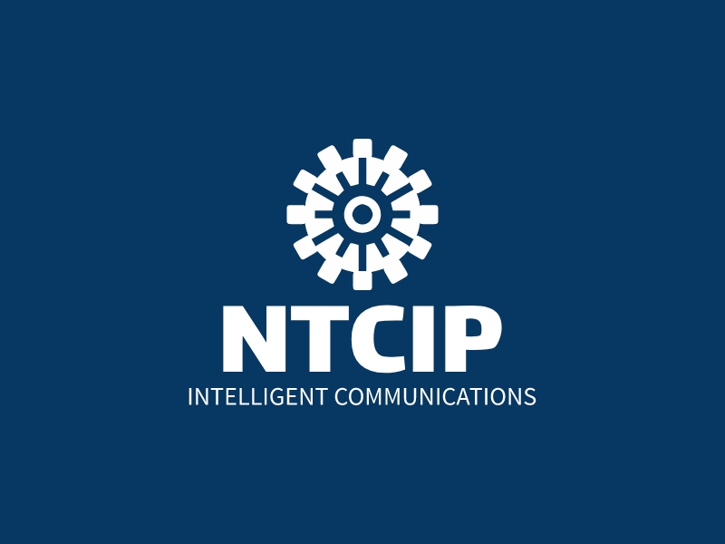

<!-- markdownlint-disable MD033 -->

  
  <strong>Proposed Draft</strong>
  <h1>Intelligent Transportation Systems (ITS) Open-Source Sandbox</h1>
  <strong>A sandbox for WG members</strong>

<!-- markdownlint-enable MD033 -->

## Important Links

- [Discussion forum](https://github.com/ite-org/OpenSourceSandbox/discussions)
- [Report an issue](https://github.com/ite-org/OpenSourceSandbox/issues)
- [Report a security issue](SECURITY.md)
- [Requirements for making contributions](CONTRIBUTING.md)
- [Code of Conduct](CODE_OF_CONDUCT.md)
- [License](LICENSE.md), which references the [Creative Commons CC BY 4.0 License](https://creativecommons.org/licenses/by/4.0/).

## Installation Instructions

This is a documentation-only project for experimentation purposes so that WG
members can become familiar with the toolset being recommended by NTCIP 8008
and the process to define issues, assign issues, make contributions, etc.

This project uses the following tools:

- Git
- GitHub
- MkDocs
- Materials for MkDocs

The proess to install the local environment is defined in the
[documentation conventions](https://k-vaughn.github.io/ITS-open-source/)
of the [ITS Open-Source Process](https://k-vaughn.github.io/ITS-open-source/)
with no exceptions or extensions.

## Project Summary

### Status

The project is purely for experiments by the WG and is not expected to
become an official document.

### Project Plan

The project will be edited by WG members as needed to gain experience
with the tool set.

### Acknowledgements

This project is part of the broader NTCIP standards effort that receives
support from the US Department of Transportation (USDOT).

## 🤝 Open-Source Development

Within traditional standards development processes, stakeholder concerns are
reported as comments, primarily during defined stages of the project. Within an
open-source environment, concerns are documented as issues and can be submitted
at any time.

All updates to the project are initiated by a stakeholder first reporting an
issue. Issues can be as minor as reporting a typo or as major as suggesting a
new section or complete rewrite of the document. If you have identified an
issue, please submit it on our
[Issues](https://k-vaughn.github.io/ITS-open-source/issues) page.

When submitting an issue, the commenter is required to identify the type of
issue and then provide specific information for that issue. Issue types that are
applicable to this project include:

- **Bug report:** used to report an issue or inaccuracy in the documentation
- **Documentation enhancement:** used to suggest improvements to the project documentation
- **New requirement request:** used to propose a new requirement to be added to
  the documentation
- **Requirement modification request:** used to suggest a modification to an
  existing requirement

If you identify a security issue, please report it using our [security process](SECURITY.md).

As with comments in the traditional standards process, issues are reviewed and
prioritized prior to being addressed. In the traditional process, the initial
review is performed by the editor; within the open-source process, the review is
performed by the maintainer. Depending on the impact of the issue, the
maintainer can either prioritize the issue directly or might seek guidance from
the working group.

Once an issue has been prioritized, it is made available for anyone in the
open-source community to make a contribution to address the issue.
